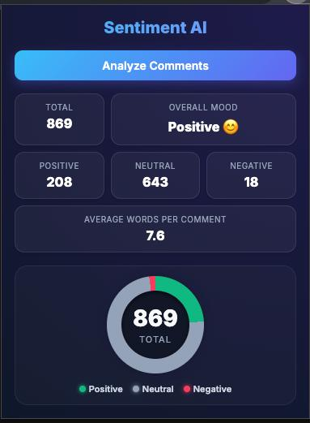

# YouTube Sentiment Insights

A Machine Learning-powered Chrome Extension that analyzes YouTube comments and provides real-time audience sentiment insights through an interactive dashboard.

## Overview

YouTube Sentiment Insights helps users understand audience reactions to any YouTube video by automatically collecting comments, performing sentiment analysis, and visualizing the results through an intuitive dashboard.

The project combines Natural Language Processing (NLP), Machine Learning, Flask API development, and Chrome Extension development to deliver actionable sentiment analytics directly within the browser.

---

## Demo

### Extension Dashboard



*Interactive dashboard showing audience sentiment distribution, overall mood detection, sentiment counts, average comment statistics, and real-time analytics generated from YouTube comments.*

---

## Features

### Sentiment Analysis Dashboard

* Total comment count
* Positive comment count
* Negative comment count
* Neutral comment count
* Average words per comment
* Overall audience mood detection
* Interactive donut chart visualization

### Smart Comment Collection

* Automatically scrolls through YouTube comments
* Collects large numbers of comments using infinite scrolling
* Removes duplicate comments
* Handles dynamically loaded YouTube content

### Machine Learning Powered

* TF-IDF Vectorization
* Text preprocessing pipeline
* LightGBM classifier
* Real-time prediction through Flask API

### Performance Optimizations

* Parallel API requests using Promise.all()
* Chunked processing for large comment sets
* Efficient duplicate removal using Set()
* Asynchronous Chrome messaging

---

## System Architecture

```text
YouTube Video
      │
      ▼
Chrome Extension
      │
      ▼
Comment Collection
      │
      ▼
Flask REST API
      │
      ▼
Text Preprocessing
      │
      ▼
TF-IDF Vectorization
      │
      ▼
LightGBM Model
      │
      ▼
Sentiment Prediction
      │
      ▼
Interactive Dashboard
```

---

## Technology Stack

### Machine Learning

* Python
* Scikit-learn
* LightGBM
* Pandas
* NumPy
* NLTK
* Joblib

### Backend

* Flask
* Flask-CORS

### Frontend

* JavaScript
* HTML5
* CSS3

### Browser Extension

* Chrome Extension Manifest V3

---

## Project Structure

```text
sentiment-analysis/
│
├── backend/
│   ├── app.py
│   └── predict.py
│
├── models/
│   ├── final_model.pkl
│   └── tfidf_vectorizer.pkl
│
├── src/
│   ├── data/
│   │   └── data_preprocessing.py
│   │
│   └── features/
│       └── vectorization.py
│
├── extension/
│   ├── manifest.json
│   ├── content.js
│   ├── popup.html
│   ├── popup.js
│   └── background.js
│
├── assets/
│   └── dashboard-demo.jpg
│
└── README.md
```

---

## Machine Learning Pipeline

### 1. Text Preprocessing

The preprocessing pipeline performs:

* Lowercasing
* URL removal
* Punctuation removal
* Stopword removal
* Lemmatization

### 2. Feature Extraction

TF-IDF Vectorization is used to transform text into numerical features suitable for machine learning.

### 3. Model Prediction

The trained LightGBM model predicts one of three sentiment classes:

| Label | Sentiment |
| ----- | --------- |
| 0     | Neutral   |
| 1     | Positive  |
| 2     | Negative  |

---

## Model Performance

The sentiment classification model was evaluated on a held-out test dataset containing **7,376 samples**.

### Model Comparison

| Model               | Accuracy   |
| ------------------- | ---------- |
| Logistic Regression | 83.42%     |
| Random Forest       | 63.61%     |
| XGBoost             | 77.96%     |
| LightGBM            | **84.75%** |

LightGBM achieved the highest accuracy and was selected as the final production model used by both the Flask API and Chrome Extension.

### Classification Report

| Sentiment | Precision | Recall | F1-Score |
| --------- | --------- | ------ | -------- |
| Neutral   | 0.81      | 0.97   | 0.89     |
| Positive  | 0.88      | 0.84   | 0.86     |
| Negative  | 0.84      | 0.67   | 0.75     |

### Overall Metrics

* Accuracy: **84.75%**
* Macro F1-Score: **0.83**
* Weighted F1-Score: **0.84**
* Training Samples: **29,502**
* Test Samples: **7,376**

### Model Selection

Multiple machine learning algorithms were trained and evaluated:

* Logistic Regression
* Random Forest
* XGBoost
* LightGBM

After comparing performance across all models, LightGBM was selected due to its superior accuracy, strong generalization capability, and efficient inference speed for real-time sentiment prediction.

---

## API Endpoint

### Predict Sentiment

```http
POST /predict
```

### Request

```json
{
  "text": "I absolutely love this video"
}
```

### Response

```json
{
  "text": "I absolutely love this video",
  "sentiment": "Positive"
}
```

---

## Installation

### Clone Repository

```bash
git clone https://github.com/galibhub/sentiment-analysis.git

cd sentiment-analysis
```

### Create Environment

```bash
conda create -n sentiment python=3.11

conda activate sentiment
```

### Install Dependencies

```bash
pip install -r requirements.txt
```

---

## Run Backend

```bash
python -m backend.app
```

Server:

```text
http://127.0.0.1:5001
```

---

## Load Chrome Extension

1. Open Chrome
2. Navigate to:

```text
chrome://extensions
```

3. Enable Developer Mode
4. Click **Load Unpacked**
5. Select the extension folder

---

## Usage

1. Start the Flask backend
2. Open any YouTube video
3. Scroll down until comments load
4. Click the extension icon
5. Click **Analyze Comments**
6. Wait for processing to complete
7. View sentiment statistics and visualization

---

## Example Dashboard Metrics

* Total Comments Analyzed
* Positive Sentiment Percentage
* Neutral Sentiment Percentage
* Negative Sentiment Percentage
* Average Comment Length
* Audience Mood Classification

---

## Future Improvements

* Batch prediction endpoint
* Faster inference pipeline
* Export analytics to CSV
* Historical sentiment tracking
* Channel-level analytics
* Real-time sentiment monitoring
* Topic modeling
* Emotion detection
* Multi-language support

---

## Learning Outcomes

This project demonstrates practical experience with:

* Natural Language Processing
* Sentiment Analysis
* Machine Learning Deployment
* REST API Development
* Chrome Extension Development
* Asynchronous JavaScript
* Frontend Data Visualization
* End-to-End ML Application Development

---

## Author

**Ibrahim Galib**

Aspiring Machine Learning Engineer | MERN Stack Developer

GitHub:
https://github.com/galibhub

LinkedIn:
https://www.linkedin.com/in/ibrahim-galib

---

## License

This project is licensed under the MIT License.
