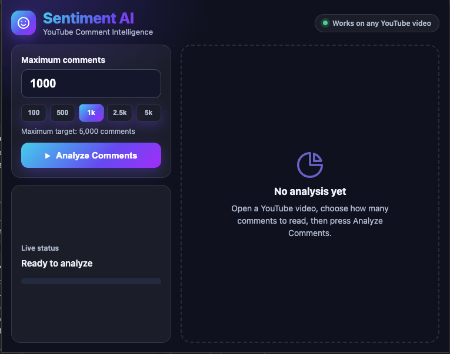
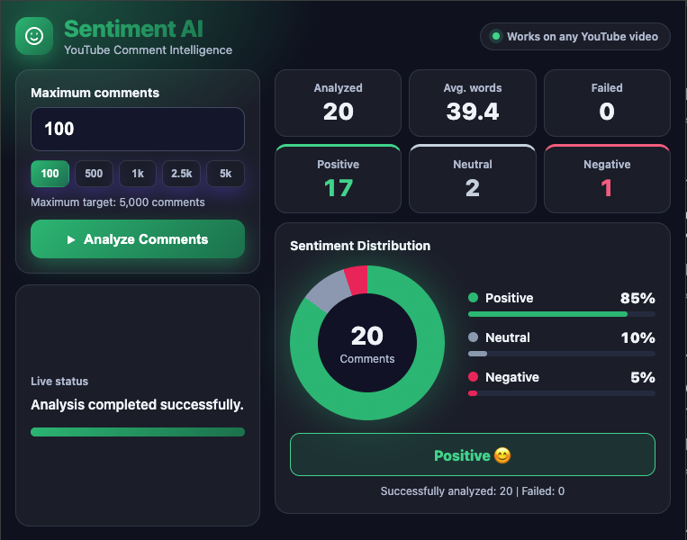

# YouTube Sentiment Insights

A Machine Learning-powered Chrome Extension that analyzes YouTube comments and visualizes audience sentiment through an interactive dashboard.

<p align="center">
  
</p>

<p align="center">
  
</p>

<p align="center">
  <strong>Python · Scikit-learn · LightGBM · Flask · JavaScript · Chrome Extension</strong>
</p>

## Project Demo Video

[Watch the YouTube Sentiment Insights demo](https://drive.google.com/file/d/1BI5_D8ACGUpPkHf5ZndWbBBsWgWBs5-i/view)

---

## Overview

**YouTube Sentiment Insights** is an end-to-end Machine Learning application designed to analyze audience reactions to YouTube videos. It automatically collects comments, classifies their sentiment, and presents the results in an interactive analytics dashboard.

The application combines Natural Language Processing (NLP), Machine Learning, Flask REST API development, and Chrome Extension technology to transform unstructured YouTube comments into meaningful sentiment insights.

The system classifies comments into three sentiment categories:

- Positive
- Negative
- Neutral

The final model, LightGBM, achieved **84.75% accuracy** on a held-out test dataset of 7,376 samples.

## Key Features

### 📊 Interactive Sentiment Dashboard

- Total comments analyzed
- Positive, negative, and neutral comment counts
- Sentiment distribution visualization
- Average words per comment
- Overall audience mood detection
- Interactive donut chart
- Real-time analytics presentation

### 💬 Automated Comment Collection

- Automatically collects comments from YouTube videos
- Supports dynamic content and infinite scrolling
- Removes duplicate comments
- Handles dynamically loaded YouTube content
- Processes large comment collections in chunks

### 🤖 Machine Learning-Powered Analysis

- NLP-based text preprocessing
- TF-IDF feature extraction
- LightGBM sentiment classification
- Flask REST API integration
- Automated sentiment prediction

### ⚡ Performance Optimizations

- Parallel API requests using `Promise.all()`
- Chunked processing for large comment collections
- Efficient duplicate removal using JavaScript `Set`
- Asynchronous Chrome messaging
- Efficient inference through a pre-trained model

## System Architecture

```text
             YouTube Video
                   |
                   v
          Chrome Extension
                   |
                   v
         Comment Collection
                   |
                   v
           Flask REST API
                   |
                   v
         Text Preprocessing
                   |
                   v
          TF-IDF Vectorizer
                   |
                   v
          LightGBM Model
                   |
                   v
        Sentiment Prediction
                   |
                   v
       Interactive Dashboard
```

## Technology Stack

| Category | Technologies |
|---|---|
| Programming Language | Python, JavaScript |
| Machine Learning | Scikit-learn, LightGBM |
| Natural Language Processing | NLTK, TF-IDF |
| Data Processing | Pandas, NumPy |
| Model Serialization | Joblib |
| Backend | Flask, Flask-CORS |
| Frontend | HTML5, CSS3, JavaScript |
| Browser Extension | Chrome Extension Manifest V3 |
| Data Visualization | Interactive Donut Chart |

## Machine Learning Pipeline

The sentiment analysis pipeline consists of three major stages.

### 1. Text Preprocessing

Raw YouTube comments are cleaned and normalized before feature extraction.

The preprocessing pipeline includes:

- Lowercasing
- URL removal
- Punctuation removal
- Stopword removal
- Lemmatization

### 2. Feature Extraction

**TF-IDF (Term Frequency–Inverse Document Frequency)** converts preprocessed comments into numerical feature vectors.

These vectors represent the importance of words in each comment and are used as input for the classification model.

### 3. Sentiment Classification

A pre-trained LightGBM classifier predicts one of three sentiment classes.

| Label | Sentiment |
|:---:|---|
| 0 | Neutral |
| 1 | Positive |
| 2 | Negative |

The predicted labels are returned through the Flask API and used to generate the sentiment analytics displayed in the Chrome Extension.

## Model Performance

Four Machine Learning algorithms were trained and evaluated on a held-out test dataset containing **7,376 samples**.

### Model Comparison

| Model | Accuracy |
|---|---:|
| Logistic Regression | 83.42% |
| Random Forest | 63.61% |
| XGBoost | 77.96% |
| **LightGBM** | **84.75%** |

LightGBM achieved the highest accuracy among the four evaluated models and was selected as the final model for deployment.

### Classification Report

| Sentiment | Precision | Recall | F1-Score |
|---|---:|---:|---:|
| Neutral | 0.81 | 0.97 | 0.89 |
| Positive | 0.88 | 0.84 | 0.86 |
| Negative | 0.84 | 0.67 | 0.75 |

### Overall Evaluation Metrics

| Metric | Value |
|---|---:|
| Accuracy | **84.75%** |
| Macro F1-Score | **0.83** |
| Weighted F1-Score | **0.84** |
| Training Samples | 29,502 |
| Test Samples | 7,376 |

### Model Selection

The final model was selected after comparing Logistic Regression, Random Forest, XGBoost, and LightGBM.

LightGBM was selected based on its higher test accuracy among the evaluated models and its suitability for integration into the prediction API.

## Project Structure

```text
sentiment-analysis/
│
├── backend/
│   ├── app.py
│   └── predict.py
│
├── models/
│   ├── final_model.pkl
│   └── tfidf_vectorizer.pkl
│
├── src/
│   ├── data/
│   │   └── data_preprocessing.py
│   │
│   └── features/
│       └── vectorization.py
│
├── extension/
│   ├── manifest.json
│   ├── content.js
│   ├── popup.html
│   ├── popup.js
│   └── background.js
│
├── assets/
│   ├── ui.jpg
│   └── dashboard-demo.jpg
│
├── requirements.txt
└── README.md
```

## API Documentation

The application uses a Flask REST API to perform sentiment prediction.

### Predict Sentiment

**Endpoint:** `POST /predict`

**Content-Type:** `application/json`

#### Request

```json
{
  "text": "I absolutely love this video"
}
```

#### Response

```json
{
  "text": "I absolutely love this video",
  "sentiment": "Positive"
}
```

The endpoint accepts a text input and returns the corresponding sentiment prediction.

## Installation and Setup

### Prerequisites

- Python 3.11
- Google Chrome
- Git
- pip

### 1. Clone the Repository

```bash
git clone https://github.com/galibhub/sentiment-analysis.git
cd sentiment-analysis
```

### 2. Create a Virtual Environment

Using Conda:

```bash
conda create -n sentiment python=3.11
conda activate sentiment
```

Alternatively, using Python's built-in virtual environment:

```bash
python -m venv .venv
source .venv/bin/activate
```

### 3. Install Dependencies

```bash
pip install -r requirements.txt
```

## Running the Application

### 1. Start the Flask Backend

From the project root directory, run:

```bash
python -m backend.app
```

The Flask server will be available at:

```text
http://127.0.0.1:5001
```

### 2. Load the Chrome Extension

1. Open Google Chrome.
2. Navigate to `chrome://extensions`.
3. Enable **Developer mode**.
4. Click **Load unpacked**.
5. Select the project's `extension` directory.
6. Pin the extension to the Chrome toolbar for easy access.

### 3. Analyze YouTube Comments

1. Start the Flask backend.
2. Open a YouTube video in Chrome.
3. Scroll down to load the video's comments.
4. Click the YouTube Sentiment Insights extension icon.
5. Click **Analyze Comments**.
6. Wait for the comment collection and sentiment analysis to finish.
7. Explore the resulting sentiment statistics and interactive dashboard.

## Example Dashboard Insights

The dashboard provides the following analytics:

| Metric | Description |
|---|---|
| Total Comments | Total number of comments analyzed |
| Positive Sentiment | Number of positive comments |
| Negative Sentiment | Number of negative comments |
| Neutral Sentiment | Number of neutral comments |
| Average Words | Average number of words per comment |
| Audience Mood | Overall sentiment-based audience mood |
| Sentiment Distribution | Proportions of sentiment categories |

## Future Improvements

The following features are potential directions for further development:

- **Batch Prediction API:** Reduce API overhead by predicting multiple comments in a single request.
- **Inference Optimization:** Improve prediction throughput and reduce response latency.
- **CSV Export:** Allow users to export sentiment analytics.
- **Historical Sentiment Tracking:** Track sentiment changes over time.
- **Channel-Level Analytics:** Analyze audience sentiment across multiple videos.
- **Real-Time Monitoring:** Monitor sentiment as new comments become available.
- **Topic Modeling:** Identify recurring topics and discussion themes.
- **Emotion Detection:** Extend classification to emotions such as joy, anger, and sadness.
- **Multilingual Support:** Extend sentiment analysis to additional languages.

## Learning Outcomes

This project provided practical experience in:

- Natural Language Processing and text preprocessing
- TF-IDF feature engineering
- Supervised Machine Learning
- Model training and evaluation
- Comparative analysis of classification algorithms
- LightGBM model deployment
- Flask REST API development
- Chrome Extension development using Manifest V3
- Asynchronous JavaScript and API integration
- Interactive data visualization
- End-to-end Machine Learning application development

## Author

**Ibrahim Ahmed Galib**

Aspiring Machine Learning Engineer | MERN Stack Developer

<p>
  <a href="https://github.com/galibhub">GitHub</a> ·
  <a href="https://www.linkedin.com/in/ibrahim-galib">LinkedIn</a>
</p>

## License

This project is licensed under the MIT License. See the `LICENSE` file for details.
